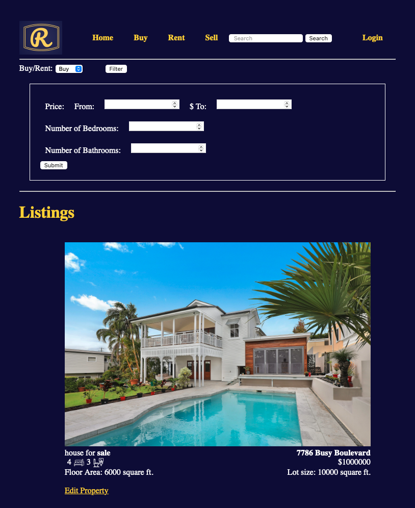

# RealEstateApp
Simple flask real estate web application.
Uses MongoDB as the database system

## How to run
After cloning the repository run the command
```
flask --app flaskrealestateapp run
```

