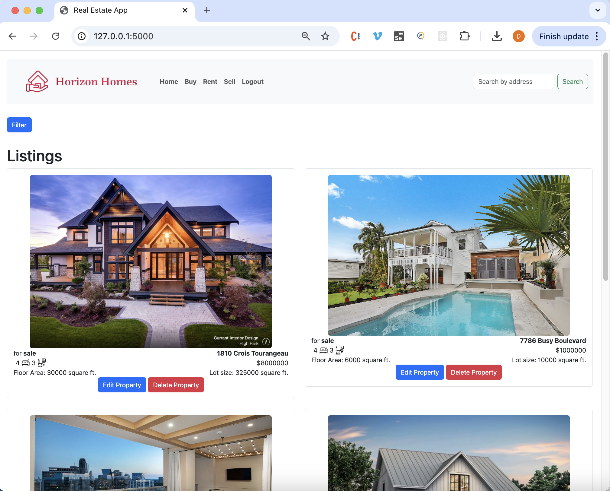
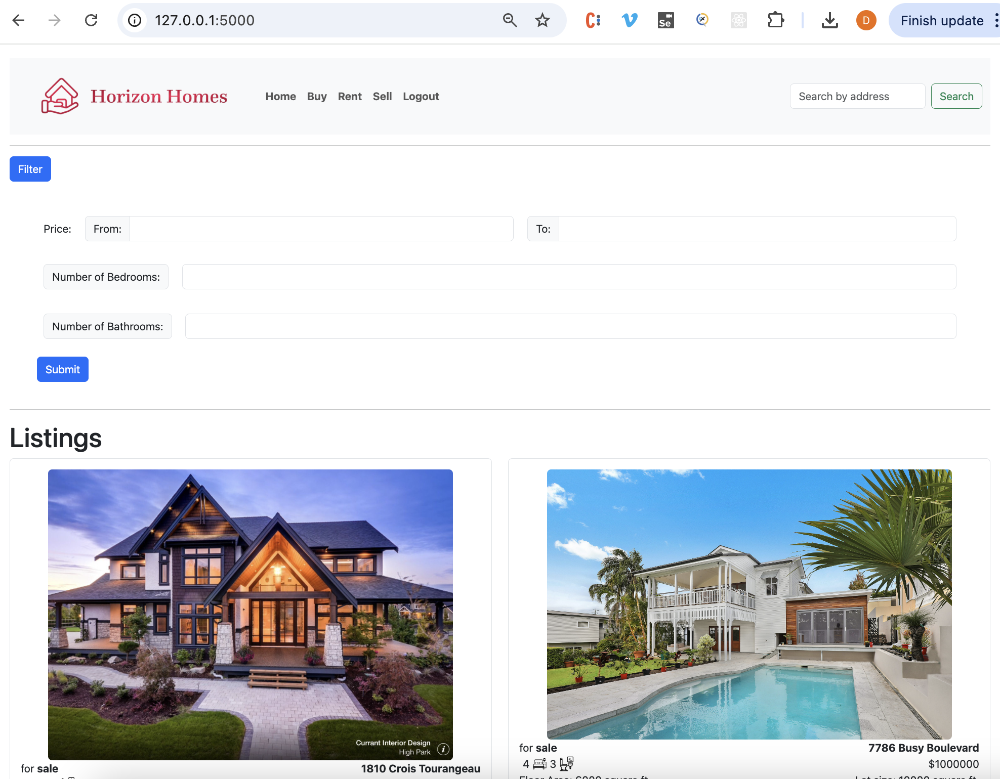
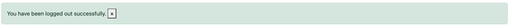

# Real Estate Web App

## Overview
Real estate web application that is build using:
- Flask
- MongoDB
- Bootstrap
The app allows to search for properties using property address, filter them based on price and number of bedrooms/bathrooms.

## Features
- Display of properties with all their details
- Filter properties
- Possibility to Login/Logout/Create account
- Possibility to edit or delete a property (if user is logged in)
- Upload property images
- Flash messages for better feedback to the user

## Technologies Used
- Backend: Flask
- Database: MongoDb
- Front End: Html, Css, bootstrap
- Other: Jinja was used for templating

## How to run the application
1. Clone the repo
   `cd [repo-name]`
2. Create a virtual enviroment:
   `python -m venv venv`
3. Activate virtual environment
   `source venv/bin/activate`
4. Install requirements
   `pip install -r requirements.txt`
   `npm install`
5. Run the app
   `flask --app flaskrealestateapp run`

